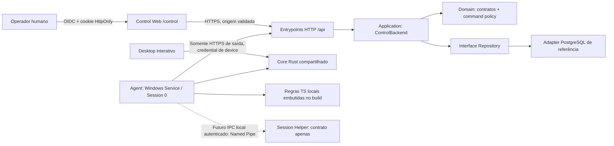
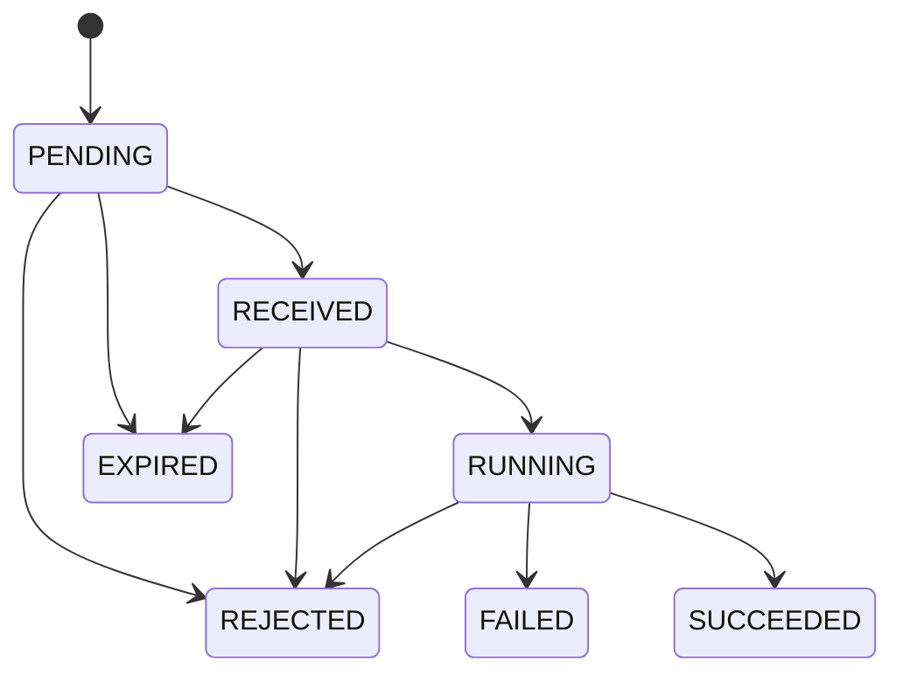

# CENTRAL SOS Control + Agent + Backend + Updater — revisão da fundação

## Estado e escopo

Revisão local em `feature/network-diagnostic`, sem commit, push, merge ou alteração
na versão do produto (0.1.0). Nenhum backend, banco, provedor OIDC, Agent instalado,
chave de assinatura ou atualização real foi provisionado. O updater permanece
inativo sem chave pública/endpoint válidos; API sem infraestrutura retorna 503.
As ferramentas locais continuam independentes de login, Control e conexão.

## Problemas encontrados e corrigidos

| Risco | Achado | Correção |
|---|---|---|
| Alto | Snapshot na conta de serviço podia informar SYSTEM como usuário e confundir impressoras de sessão ausentes com defeito | Adapter exclusivo do Agent omite usuário/impressoras de sessão e unidades mapeadas; resultados explícitos USER_SESSION_REQUIRED |
| Alto | printer.auto_fix podia agir sobre diagnóstico incompleto de Session 0 | Bloqueio em TypeScript e Rust, antes de qualquer efeito; helper autenticado ainda não existe |
| Alto | HKCU do serviço podia ser usado como HKCU do usuário | collect_for_agent consulta somente HKLM; ausência de programa por usuário fica ignored, sem inventar erro |
| Alto | Comandos não possuíam versão de protocolo independente | protocolVersion=1 explícito em enrollment, heartbeat, comandos e resultados; versões incompatíveis bloqueiam comandos |
| Alto | Vínculo dependia somente de Environment, sem empresa original gravada | Company gravada pelo backend no pareamento/dispositivo; alteração de associação rejeitada e inventário inconsistente não exposto |
| Alto | Journal usava SELECT/INSERT separados | Transação SQLite IMMEDIATE para claim; primeiro resultado imutável; duplicatas nunca ganham nova execução |
| Médio | Prioridades/operações permitidas dispersas | Matriz JSON única consumida por TS e embutida por Rust |
| Médio | Dispatch gerava texto JavaScript para eval | Argumentos agora são valores JS via from_json/call; fonte aceita é somente bundle imutável do build; eval/Function globais removidos |
| Médio | Retries sem jitter/status/Retry-After | Transporte mantém metadados; jitter real, teto de backoff, cooldown 401/403 e Retry-After |
| Médio | Ausência de deadline entre efeitos | Orçamento monotônico e validade verificados antes de cada operação e ao concluir; sem replay de efeito incerto |
| Médio | UI reportava versão do crate Link como versão observada do Agent | Versões reais Agent/Core/protocolo vêm do heartbeat e status local, desconhecidas antes da primeira comunicação |
| Alto | Diretório do Agent preexistente podia continuar sob owner de usuário comum | Parent/pasta/arquivos exigem owner SYSTEM/Administradores; DACL protegida e owner administrativo; links/hardlinks recusados antes de leitura |
| Médio | reg.exe resolvido pelo PATH da conta de serviço | Utilitário fixo e somente leitura localizado por GetSystemDirectoryW; falha fecha a consulta |

A matriz não torna uma operação segura apenas por dar-lhe um nome. Payloads têm
schemas estritos; a ponte nativa limita novamente cada operação ao comando atual,
destinatário, confirmação, perfil, prazo e contexto. Alterações locais existentes
em Impressoras/Rede/Computador/Tools/Serviços/validações/elevação/navegação foram
preservadas. Somente adapters necessários à coleta do Agent foram acrescentados
nas consultas compartilhadas; o caminho interativo mantém seu comportamento.

## Componentes e trust boundaries

- Internet → HTTP: validar sessão humana ou credencial de dispositivo; nunca
  intercambiáveis. HTTPS e ausência de redirects protegem o Bearer do Agent.
- Control → domínio: identidade/empresa/permissões vêm do servidor, não do payload.
  Viewer consulta; operator envia comandos; admin também emite código de vínculo.
- Backend → Windows: contrato fechado, sem código/arquivo/comando arbitrário.
- Session 0 → sessão interativa: fronteira de identidade, não contornada com
  acesso administrador, impersonation automática ou senha SMB.
- Armazenamento local: DPAPI de máquina + diretório ProgramData com DACL protegida
  SYSTEM/Administradores; parent/pasta/arquivos exigem owner confiável, a pasta pai
  é protegida antes de criar o estado; reparse points e arquivos com múltiplos hardlinks
  são recusados antes de leitura/mudança de ACL. Pasta preexistente de owner não
  confiável é recusada, sem apagar/aceitar seus dados. Administrador
  local é uma fronteira de confiança e pode comprometer um Agent privilegiado.
- Release → updater: validação de assinatura pelo plugin oficial; chave privada
  fica somente na máquina de assinatura. Metadados do servidor não substituem assinatura.

Separação atual: contratos/políticas em `src/control`, application em
`server/control/ControlBackend.ts`, interfaces em `Repository.ts`, adapters
PostgreSQL/autenticação/rate-limit, HTTP em `HttpApi.ts` + `/api`. Pasta única
server/control não impede essas fronteiras; não houve reorganização cosmética.
PostgreSQL é um adapter de referência substituível. Não foi escolhido provedor.
Estado MVP é JSONB com lock transacional entre réplicas; usuários, memberships,
sessões e rate limit têm tabelas próprias. Escala/retencão/normalização e banco
real precisam ser definidos/testados antes de produção. Company permanece um
contrato sem CRUD/tabela própria; IDs/ambientes/memberships são provisionados
por administração externa, não por dados enviados pelo device.

## Execution contexts

Classificação declarada em `src/control/CommandPolicy.ts`:

| Operação/dado | Contexto | Limite |
|---|---|---|
| Hostname, Windows, CPU, RAM, BIOS, hardware | MACHINE_SYSTEM_SAFE | Fatos de máquina; usuário atual não faz parte |
| Volumes locais, adapters/IP/gateway/DNS | MACHINE_SYSTEM_SAFE | Agent filtra DriveType local; unidades mapeadas não representam inventário global |
| HKLM, serviços SCM/WMI, Spooler | MACHINE_SYSTEM_SAFE | Serviço específico usa nome interno, sem execução do PathName |
| Inventário consolidado/validação e filas locais | USER_SESSION_PREFERRED | Parte de máquina útil; não comprova o inventário por usuário |
| Usuário atual, HKCU, impressora padrão e por usuário | USER_SESSION_REQUIRED | Não usar a conta do serviço como identidade do usuário |
| Impressoras RDP/redirecionadas, queues UNC/per-user | USER_SESSION_REQUIRED | Falta de visibilidade não é ausência/defeito |
| WinINET/proxy do usuário, mapped drives, credencial SMB, profile paths | USER_SESSION_REQUIRED | Agent não consulta/impersona sessões nesta etapa |
| Processos com significado de sessão | USER_SESSION_PREFERRED | Sem comando remoto de processos; não coletados no heartbeat |
| UI/ações locais não cadastradas/executor arbitrário | UNSUPPORTED_REMOTE | Também LOCAL_ONLY na política de risco; não expostos pelo contrato |

Operações exatas da ponte reutilizada:

| nativeOperation | Serviço existente | Execution context |
|---|---|---|
| snapshot | snapshot::collect_machine_snapshot_for_agent | USER_SESSION_PREFERRED (parte de máquina apenas) |
| installation | installation::collect_for_agent | USER_SESSION_PREFERRED (HKLM apenas; HKCU não verificável) |
| diagnostic | printer_diagnostics::diagnose | USER_SESSION_REQUIRED no comando misto de impressão |
| startSpooler/restartSpooler | printer_spooler::action | MACHINE_SYSTEM_SAFE; confirmação/contexto do comando também limitam |
| resume | printer_operations::set_printer_paused | USER_SESSION_REQUIRED, não habilitada para serviço sem helper |
| cancelProblemJob | printer_operations::cancel_problem_job | USER_SESSION_REQUIRED, não habilitada para serviço sem helper |
| services | windows_services::collect | MACHINE_SYSTEM_SAFE |
| settle | espera fixa de 250 ms | MACHINE_SYSTEM_SAFE (não é ação no Windows) |

Uma operação de máquina dentro de printer.auto_fix não contorna o bloqueio de
sessão imposto ao comando inteiro. ACL/permissões/instalações/remoção e demais
mutadores existentes não são operações da ponte remota (UNSUPPORTED_REMOTE).

O HTTP usa reqwest/rustls de máquina; não supõe herdar WinINET/proxy autenticado
do usuário. Proxies corporativos/certificados ainda requerem teste de implantação.
Processos, perfil de usuário, credenciais SMB e configurações de proxy não são
inventariados por este Agent. O snapshot não coleta todas essas fontes.

### Impressoras e validação no Agent

Decisão conservadora: os comandos mistos de impressão exigem sessão; não existe
atualmente evidência/contrato de helper que permita interpretar todo esse escopo
com segurança como SYSTEM. printer.check e printer.auto_fix retornam estrutura
`status/code/executionContext = USER_SESSION_REQUIRED`, operação e explicação.
Runner registra REJECTED com esses detalhes, não erro de impressora nem sucesso
falso. Nenhum diagnóstico/correção de impressão é executado nessas condições.
Até uma impressora local aparentemente disponível não habilita o auto-fix remoto.
As operações interativas Desktop de Impressoras continuam usando a implementação
existente. Restart explícito do Spooler é máquina, exige confirmação e auditoria.

machine.refresh continua útil para fatos de máquina. Usuário fica vazio e printers
possui erro USER_SESSION_REQUIRED e inventário não coletado; sessionContext
explicita também HKCU, mapped drives e WinINET. Isso não significa zero impressoras.
machine.validate reutiliza ValidationEngine/registry existentes. Regras de usuário
e impressão ficam ignored com código/explicação; ausência de Cobian/Nuvem em HKLM
não comprova ausência no HKCU e fica ignored. Instalações positivamente identificadas
em HKLM podem ser avaliadas pelas regras existentes. Resumo registra cobertura
PARTIAL_USER_SESSION_REQUIRED; saúde parcial não vira OK completo (warnings).
Nenhuma regra foi duplicada ou transferida para Rust.

### Session Helper: fundação local somente leitura

Implementação e limites atuais: [Session Helper](session-helper.md).
Agent LocalSystem → Named Pipe local autenticado → executável separado na sessão
interativa. Contratos Rust/TypeScript aceitam somente session.info,
session.processes e session.printers. Session 0 nunca é fallback.
Helper/PID/token/imagem/ACL são verificados pelo Windows, com prazo, expiração,
nonce e limites. Não há shell, instalação, auto-start ou ações de usuário.
Operações antigas printer.check/auto_fix ainda não estão habilitadas no Helper.

## Matriz central de comandos

Fonte única `src/control/command-policy.json`, compilada no Agent via include_str.
Não pode ser substituída por configuração/manifesto recebido da rede.

| Comando | Contexto | Risco | Usuário | Confirmação | Timeout s | Idempotente | Auditoria |
|---|---|---|---|---|---|---|---|
| machine.refresh | USER_SESSION_PREFERRED | SAFE_READ | Não | Não | 60 | Sim | machine |
| machine.validate | USER_SESSION_PREFERRED | SAFE_READ | Não | Não | 120 | Sim | validation |
| printer.check | USER_SESSION_REQUIRED | SAFE_READ | Sim | Não | 60 | Sim | printing |
| printer.auto_fix | USER_SESSION_REQUIRED | CONFIRM_REQUIRED | Sim | Sim | 120 | Não | printing |
| spooler.restart | MACHINE_SYSTEM_SAFE | CONFIRM_REQUIRED | Não | Sim | 60 | Não | spooler |
| service.check | MACHINE_SYSTEM_SAFE | SAFE_READ | Não | Não | 60 | Sim | services |

Todos permitem TERMINAL/SERVER, declarados em allowedDeviceProfiles. SAFE_FIX e
LOCAL_ONLY são categorias reservadas; nenhum comando remoto atual é LOCAL_ONLY.
Mutadores de ACL, compartilhar/renomear/remover/adicionar impressora, instalar,
executar programas, modificar rede/Registro e ferramentas administrativas locais
não entram na allowlist. nativeOperations é validado de novo no Rust. Tipos de
payload continuam estritos: impressora selecionada/nome interno de serviço ou
objeto vazio. Não há path de executável, argumentos de shell, script, expressão,
configuração de timeout/contexto/privilégio ou operação arbitrária no payload.

Timeout é orçamento monotônico antes/depois das operações; o prazo restante
também é calculado a partir do startedAt do ACK RUNNING emitido pelo servidor,
descontando conservadoramente toda a latência do ACK. Um relógio local atrasado
não amplia essa janela monotônica. TTL é verificado antes
de cada efeito. Chamadas WMI/Win32 já iniciadas não podem ser abortadas com segurança
por esse wrapper. Se ultrapassarem orçamento/prazo, resultado FAILED com
TIMEOUT/EXPIRED_DURING_EXECUTION e revisão manual, sem novo efeito/retry. Não há
thread de efeito abandonada executando enquanto outra tentativa é iniciada.
Não se promete prazo rígido de cancelamento de uma chamada nativa bloqueada.

## Protocolo, identidade, enrollment e heartbeat

protocolVersion=1 é contrato independente de appVersion/agentVersion/coreVersion.
Enrollment incompatível é recusado sem consumir código. Heartbeat incompatível
pode registrar presença/versões (DEGRADED), mas send/poll/ACK/result não autorizam
comandos incompatíveis; Rust também revalida protocolVersion. Mensagens legadas
sem versão são rejeitadas. Não há negociação permissiva/fallback silencioso.
Mudanças de contrato futuras precisam de compatibilidade ou migração explícita.
Estado local antigo sem protocolo não é sobrescrito para fingir compatibilidade.

- Humanos: OIDC Authorization Code + PKCE, state/nonce, JWT com assinatura,
  issuer/audience/algoritmos permitidos, usuário previamente habilitado no banco.
  Cookie opaco HttpOnly/Secure/SameSite, hash persistido; permissões consultadas no
  servidor. POST Control valida Origin. Sem login/senha padrão ou cadastro automático.
- Devices: credencial aleatória 256 bits recebida somente uma vez no enrollment,
  persistida DPAPI; apenas hash SHA-256 no backend. React nunca recebe a credencial.
  Credencial não autentica Control; sessão humana não autentica endpoints Agent.
- Código SOS-XXXX-XXXX: cerca de 40 bits de entropia, TTL 10 min, só hash persistido,
  uso único consumido na mesma transação do registro; replay/concorrrência recusados.
  Rate limit compartilhado: 10 tentativas/minuto por IP hash. Código é capability
  temporária: revogar usuário depois de emitir não revoga automaticamente seu código;
  produção deve definir cancelamento/administração de pareamentos e limites globais.
- Backend fixa Company → Environment → Device e Terminal → Server do mesmo
  ambiente/empresa. Cliente não envia companyId no heartbeat; schema recusa esse
  campo. Troca externa da empresa do Environment invalida pareamento/device,
  não transfere sua autorização. Resultado/ACK de outro device é recusado.
- Falha de resposta após enrollment consumido não reemite segredo: intervenção
  administrativa/revogação/novo pareamento. Nenhum segredo aparece em log/auditoria.
- Proteger origem HTTPS, cabeçalhos de IP do proxy, sessões, backups e retenção;
  controles de escala/WAF/rate limit distribuído global ainda dependem do host real.

Heartbeat leve: hostname, SO, uptime, IP local quando não ambíguo, versões/protocolo,
healthSummary recente e IDs. Sem snapshot, fila, instalações, serviços ou processos.
HealthSummary vem da última validação (10 min); desconhecido nunca se converte em OK.
appVersion é a última versão Desktop observada no vínculo; agentVersion/coreVersion
são do binário efetivamente enviando heartbeat. Antes dele, a UI local mostra
Agent ainda não observado, em vez de assumir a versão do crate Link.

## Polling e estados do Control

- Polling nominal 7 s com jitter (6,3–7,7 s), executor único, um comando por vez.
- Heartbeat separado 30 s com jitter (aprox. 27–33 s).
- Falha de rede: backoff 5/10/20/40/60 s com jitter, nunca acima de 60 s no backoff
  normal. Sucesso zera contador e volta ao intervalo nominal.
- 401/403: esperar ao menos 300 s com jitter; não martelar credencial inválida.
- Retry-After válido (segundos ou HTTP-date) é um mínimo, inclusive acima do teto
  do backoff. Sem redirect, requisição 12 s e conexão 5 s; resposta limitada a 2 MB.
- NEVER_CONNECTED: nunca recebeu heartbeat; OFFLINE: lastSeenAt passou threshold
  (90 s padrão, configuração 30–3600); DEGRADED: conectado mas protocolo incompatível,
  saúde warning/critical ou ainda não verificada; ONLINE: recente, compatível e ok.
  Uma perda isolada de heartbeat não torna offline imediatamente. Relógio do
  backend define lastSeenAt; clock do device não força online.
- Relação Server/Terminal é topologia lógica armazenada no backend; não há inbound,
  conexão direta suporte→cliente, exposição de porta ou conexão TCP entre devices.
- Polling pode virar WebSocket/SSE futuramente preservando envelope e journal.

## State machine e semântica de idempotência

Também RECEIVED→FAILED para recebimento interrompido. Sem regressões; estados
finais imutáveis. UUID, destinatário, protocolo, payload, confirmação, solicitante
fixado pelo backend, criação e TTL 5 min são conferidos pelo Agent.

SQLite WAL/FULL, DACL administrativa, journal separado por deviceId; não criptografa
inventário/resultados, que podem conter informação técnica sensível. Credenciais
ficam fora do journal. Claim por INSERT em transação IMMEDIATE antes do ACK/efeito.
Digest inclui protocolo, destinatário, tipo, payload, confirmação, criação,
solicitante e expiração. Mesmo ID/conteúdo alterado é recusado.

| Situação | Comportamento |
|---|---|
| Caiu antes do claim persistido | Comando pode ser recebido como novo; nenhum efeito havia começado |
| Caiu após receipt, antes de ACK | Nunca executar novamente; REJECTED/FAILED com revisão manual |
| Caiu após ação, antes do resultado | Efeito incerto; nunca repetir; revisão manual |
| Caiu após salvar resultado | Outbox reenvia somente resultado, não ação |
| Resultado já recebido pelo backend, resposta perdida | Retransmissão idempotente; não duplica auditoria |
| Restart Agent | Recebimento incompleto não é reexecutado; resultado concluído é reutilizado |
| Dois polls/claims do mesmo ID | Transação permite um único New; outro não executa |
| RUNNING remoto sem journal local | Não presumir permissão para executar; efeito incerto |
| Expirou antes do efeito | EXPIRED/REJECTED, sem efeito |
| Expirou/orçamento acabou durante chamada | Nenhum efeito posterior; FAILED + revisão manual, sem replay |
| Resultado tardio de comando já EXPIRED no backend | Mantém EXPIRED com reportedStatus/details; retry não bloqueia outbox |

Garantia: início de execução no máximo uma vez por ID/journal preservado; não
exactly-once de efeitos Windows nem recuperação automática de ação incompleta.
Até leituras idempotentes não são retomadas com o mesmo ID, por conservadorismo.
SCM e runner fornecem um executor; um segundo processo Agent ativo não é um modo
suportado. Claim impede nova execução mesmo com dois consumidores, mas diagnóstico
de interrupção só tem semântica de restart com executor único. Revogação bloqueia novas requisições, não cancela uma chamada Windows já iniciada.
Não apagar journal para tentar novamente. Journal corrompido/falha de gravação impede efeito; se
resultado final não puder ser persistido após efeito, intervenção manual.

## Auditoria de execução e segredos

Ausentes no caminho remoto: generic shell executor, PowerShell/CMD remoto,
comando arbitrário, executable path do Control, porta TCP no Agent, segredo
hardcoded e chave privada do updater. Busca cobriu também a ponte TS/Rust,
payloads/schemas, serviços reutilizados e executor indireto.

Não há Context.eval nem geração de source usando payload: from_json fornece dados
à função fixa. Boa ainda interpreta JavaScript confiável embutido no build por
Script::parse/evaluate; isso é necessário para reutilizar as regras TS atuais,
não é execução de código recebido do Control. eval/Function globais são removidos;
isso não transforma Boa em sandbox para código hostil (nenhum é aceito). Registro
usa reg.exe oficial com argumentos query fixos; não shell genérico. Node/esbuild
é processo fixo apenas no build. Ferramentas locais preexistentes podem abrir
utilitários administrativos por ações locais; não estão na allowlist do Agent.

O provisionamento ainda deve garantir origem confiável dos arquivos: owner/DACL
não certificam conteúdo de estado que já tenha sido adulterado antes da proteção.
Diretórios/arquivos existentes sob SID individual, mesmo administrador, exigem
provisionamento seguro (owner SYSTEM ou grupo Administradores); não há fallback
que aceite ownership desconhecido. Não foram testadas mudanças de DACL/owner no
ProgramData real nesta revisão. Consultas de status/vínculo sem device.dpapi não
criam pasta nem alteram ACL: leitura valida ownership, DACL restrita e ausência de
links antes de aceitar estado existente. ACL aberta/unknown é recusada, inclusive
com owner administrativo.

A credencial device identifica um Agent autorizado, não certifica integridade da
máquina. Administrador local comprometido pode forjar fatos/resultados, modificar
binários/journal e acessar DPAPI de máquina. Antitamper/attestation não foram
inventados. Definir assinatura de binários, instalação em pasta protegida e
política de distribuição é pendência real de implantação.

## Lifecycle Desktop + Agent + Core e updater

| Componente | Identidade/versionamento | Atualização nesta entrega |
|---|---|---|
| Produto | Versão do release/instalador (0.1.0 mantida) | Nenhuma release/build de instalador novo |
| Desktop | appVersion registrada quando UI abre | Plugin oficial preparado, desativado sem configuração |
| Agent | agentVersion do binário em execução | Nenhuma atualização/instalação SCM implementada |
| Core | coreVersion do código compilado no Agent | Atualiza ao recompilar/instalar seu consumidor |
| Contrato | protocolVersion independente (1) | Compatibilidade estrita, não ligada ao bump do app |

Recomendação: instalador/release de produto coordena Desktop, Agent e Core da mesma
versão por padrão. Updater Tauri somente inicia/instala o pacote Desktop conforme
a configuração atual; não atualiza automaticamente `central-sos-agent.exe` nem
registra/para/reinicia um serviço. createUpdaterArtifacts e assinatura do Desktop
não cobrem por si só distribuição/lifecycle do binário Agent separado.

Contrato futuro para instalador coordenado assinado (não implementado):

1. Verificar assinatura e compatibilidade de todo pacote; staging em pasta protegida.
2. Pedir confirmação/política, bloquear novos comandos, solicitar STOP via SCM.
3. Esperar STOPPED e journal/outbox consistentes, com timeout; abortar se não parar.
   Não substituir executável em uso nem matar thread de efeito para prosseguir.
4. Preservar DPAPI, IDs, ACL, journal e estado de vínculo; backup do pacote anterior.
5. Substituir Desktop/Agent/Core assinados atomicamente quando possível; manter
   recovery ledger para falha entre substituições (não prometer transação entre arquivos).
6. Iniciar serviço, verificar versão/protocolo/heartbeat e somente então liberar comandos.
7. Em falha, parar e restaurar conjunto compatível anterior; não limpar journal
   nem reexecutar comandos durante rollback. Migração de dados tem de ser reversível
   ou rollback bloqueado com recuperação administrativa.

Se Desktop atualizou e Agent ficou antigo: mostrar versões observadas distintas.
Protocolo compatível permite somente a matriz disponível nessa versão; protocolo
incompatível → DEGRADED/comandos bloqueados até atualização coordenada. Updater
não finge que Agent foi atualizado. Agent antigo que nunca envia protocolo falha
no schema; requer provisionamento compatível. Nenhum instalador/coordenador SCM,
serviço auxiliar de update, rollout, rollback real ou helper foi criado aqui.

Updater oficial @tauri-apps/plugin-updater/tauri-plugin-updater: chave pública e
endpoint HTTPS incorporados por CENTRAL_SOS_UPDATER_PUBLIC_KEY/URL. Sem ambos ou
com formato inválido, permanece inativo. Chave privada ausente do repositório;
TAURI_SIGNING_PRIVATE_KEY/PASSWORD só na máquina de assinatura, fora do frontend.
Detecção automática/manual; instalar exige confirmação, assinatura válida e
sucesso do plugin. Reinício solicitado somente após isso. MANUAL implementado;
AUTO/MAINTENANCE_WINDOW são contratos futuros. Não gerar chaves fictícias.
Não apontar latest.json para /releases/latest deste repo (Tools pode ser latest);
seleção APP/TOOLS continua separada. Nenhuma Release existente foi alterada.

## Infraestrutura e limitações de validação

Definir URL HTTPS, banco persistente, OIDC, usuários/memberships reais, assinatura,
endpoint estável de update e provisionamento Agent/SCM. Campos necessários na
.env.example continuam vazios; CONTROL_OFFLINE_SECONDS=90 é configuração, não segredo.
MemoryRepository só testa domínio; produção exige Repository persistente e falha
503 sem configuração. Migração PostgreSQL de referência não foi aplicada.

Entrypoints api/control/[...path].ts e api/agent/[...path].ts usam imports ESM .js.
`npm.cmd run control:dev` inicia apenas backend de referência loopback 127.0.0.1:1431;
Vite 1420 faz proxy. Isso não é listener TCP do Agent. Cookies/OIDC reais exigem
HTTPS; não foi adicionado fallback inseguro para autenticar em HTTP local.
API limita payload/resposta a 2 MB; sessão/autorização, mensagens malformadas e
assinaturas são testadas com fixtures, não com infraestrutura inexistente.

Antes de produção: testar SCM sem usuário/reboot/shutdown, multi-session/RDP,
proxies/TLS, DPAPI/DACL sob SYSTEM e administrador, banco real/transações concorrentes,
OIDC real/rotatividade/sessões, diretórios preexistentes/ACL/ownership e corridas de
filesystem (não há prova formal de ausência de TOCTOU), atualização assinada e rollback de produto. Chamadas
Win32/WMI sem cancelamento rígido, escala do JSONB, retenção de journal/auditoria,
revogação administrativa de códigos e rollout compatível permanecem limitações.
Não se instalaram serviços/updates nem se administraram impressoras nos testes.

## Validações executadas

Resultados finais desta revisão (2026-10-06): typecheck/build passaram;
validation 208/208, Tools 24/24, Control 42/42; checks Desktop/Core/Agent passaram.
Rust: Agent 6/6, Link 5/5, Core sem feature Desktop 47 passaram e 1 inventário
Windows real ficou ignorado. Teste IPC adicional com feature Desktop foi tentado
e cancelado porque um tauri:dev preexistente mantém o diretório de build ocupado;
somente o processo desse teste foi encerrado, sem fechar o Desktop do usuário. Nenhuma chamada real de alteração de Windows foi
executada. git diff --check passou. Avisos de annotations do Zod e conversão
LF/CRLF do Git não causaram falha.

Comandos:

- npm.cmd run typecheck
- npm.cmd run build
- npm.cmd run test:validation
- npm.cmd run test:tools
- npm.cmd run test:control
- Cargo check Desktop, Core e Agent
- Testes Rust Agent, Link e Core
- git diff --check e comparação de hashes com o estado anterior à revisão

## Referências oficiais consultadas

- [Windows Interactive Services: Session 0 e IPC autenticado](https://learn.microsoft.com/en-us/windows/win32/services/interactive-services)
- [RegOpenCurrentUser e identidade de HKCU](https://learn.microsoft.com/en-us/windows/win32/api/winreg/nf-winreg-regopencurrentuser)
- [WinINET vs WinHTTP: limites de execução em serviços](https://learn.microsoft.com/en-us/windows/win32/wininet/wininet-vs-winhttp)
- [Tauri Updater: assinaturas e instalação Windows](https://v2.tauri.app/plugin/updater/)

## Arquivos alterados nesta revisão e preservação

24 arquivos da fundação ajustados (em relação ao início desta revisão):

- src/control/contracts.ts; src/agent/RulesRuntime.ts
- src/pages/control/ControlPage.tsx; src/pages/control/DesktopControlSettings.tsx
- src/services/control/AgentLinkService.ts
- server/control/ControlBackend.ts; server/control/Repository.ts
- crates/agent/build.rs; crates/agent/src/engine.rs; crates/agent/src/runner.rs; crates/agent/src/journal.rs
- crates/link/src/lib.rs; crates/link/src/protocol.rs; crates/link/src/vault.rs
- src-tauri/src/core.rs; src-tauri/src/commands/control.rs
- src-tauri/src/services/snapshot.rs; src-tauri/src/services/storage.rs; src-tauri/src/services/installation.rs
- tests/control/Backend.test.mjs; tests/control/Esm.test.mjs; tests/control/RulesRuntime.test.mjs
- tsconfig.node.json; docs/control-agent-updater.md

5 arquivos novos:

- src/control/command-policy.json; src/control/CommandPolicy.ts
- src/control/SessionHelperContract.ts; crates/link/src/policy.rs
- tests/control/Security.test.mjs

Comparação SHA-256 do estado anterior: 223 arquivos existentes preservados ou
ajustados exclusivamente nos caminhos acima; nenhum removido. Os arquivos de
Rede, UI de Impressoras, Tools/Downloads, Computador, Serviços, validações,
menu e elevação permaneceram byte a byte iguais ao início desta revisão.
Package/Cargo/tauri.conf versões e lockfiles também não mudaram nesta revisão.
Busca por padrões usuais de tokens GitHub/chaves privadas em fontes versionáveis
complementou os testes; isso não é garantia de detectar todo segredo possível.

Git: feature/network-diagnostic; HEAD a63cae02a0236e3c5c27df88bd9f6995b2272f89
inalterado. Worktree continua com alterações anteriores e desta revisão, sem
stage, commit, push ou merge. Produto continua 0.1.0; nenhuma infraestrutura,
credencial operacional, release ou instalador foi criado.
