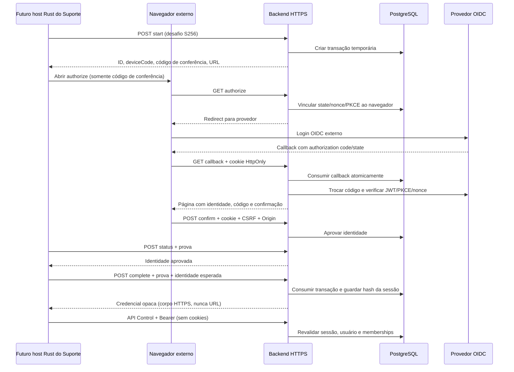

# Autenticação nativa do CENTRAL SOS Suporte

## 1. Arquitetura e escolha do fluxo

O Backend existente continua como cliente confidencial OIDC. O futuro Desktop
Suporte pede uma transação, abre o navegador padrão e resgata uma sessão opaca
somente depois da confirmação explícita do operador. O Web público continua como
portal; nenhuma tela operacional foi adicionada ao Web ou ao Cliente.

Há duas provas distintas: PKCE S256 no Authorization Code do Backend com o
provedor OIDC, e um desafio S256 de posse no vínculo Desktop/Backend. A segunda
prova impede que conhecer o ID ou o código de conferência baste para resgatar o
token. O segredo OIDC nunca é entregue ao Desktop.

Esta é uma extensão de handoff específica do Backend, **não uma implementação
completa do OAuth Device Grant**. O fluxo de dispositivo fornece referências
úteis para códigos, polling e confirmação, mas não é a escolha padrão para um
aplicativo capaz de abrir navegador e executar Authorization Code. Não existe
ainda registro de cliente público nativo/redirect do Suporte; reutilizamos o
cliente confidencial existente. Se o provedor futuro oferecer um fluxo nativo
padronizado apropriado, esta decisão deve ser reavaliada antes da distribuição.
Referências: [OAuth para aplicativos nativos, RFC 8252](https://www.rfc-editor.org/rfc/rfc8252),
[PKCE, RFC 7636](https://www.rfc-editor.org/rfc/rfc7636),
[Device Authorization, RFC 8628](https://www.rfc-editor.org/rfc/rfc8628) e
[OAuth Security BCP, RFC 9700](https://www.rfc-editor.org/rfc/rfc9700).

## 2. Diagrama

## 3. Endpoints

Todos os endpoints nativos estão em `/api/control/auth/native`. A Function
catch-all existente atende esses caminhos; não há novo serviço/deployment.

| Método/caminho | Consumidor | Entrada e resposta |
| --- | --- | --- |
| POST `/start` | Rust | protocolVersion=1, codeChallenge/S256 → transação |
| GET `/authorize?user_code=…` | Navegador | código de conferência → cookie temporário e redirect OIDC |
| GET `/callback?state=…&code=…` | Navegador/OIDC | cookie vinculado → confirmação fixa, sem token na URL |
| GET `/confirm?id=…` | Navegador | cookie vinculado → HTML com código/identidade/CSRF |
| POST `/confirm` | Navegador | cookie, Origin, CSRF, código, checkbox → aprovação |
| POST `/status` | Rust | ID, deviceCode, codeVerifier → pending ou approved + identidade |
| POST `/complete` | Rust | mesma prova + expectedSubject → credencial de sessão |
| GET `/session` | Rust/adapter | Bearer → identidade, memberships, expiração, scope |
| POST `/logout` | Rust/adapter | Bearer → revogação idempotente da sessão conhecida |

Chamadas nativas exigem `X-Central-Sos-Client: support-native-v1`, sem `Cookie`
nem `Origin`. Esse header **não autentica** o aplicativo: a prova ou o Bearer
continuam obrigatórios. Não foi habilitado CORS. Browser confirma com cookie
`__Host-`/HttpOnly/Secure/SameSite=Lax (Path=/, sem Domain), Origin exata e CSRF por transação. Cookies Web
existentes seguem separados e não são convertidos em sessões nativas.

Endpoints JSON nativos não aceitam query string, redirects de destino nem campos
extras. Confirmação aceita JSON ou formulário; checkbox deve ser explicitamente
`true`/`on`. HTML escapa identidade e possui CSP sem scripts, `form-action 'self'`,
`frame-ancestors 'none'` e Referrer-Policy no-referrer. Responses não são cacheadas.

## 4. Contratos

`packages/contracts/control/NativeAuthentication.ts` contém schemas estritos e
tipos compartilhados. `protocolVersion: 1` versiona o handoff independentemente
da versão do produto/protocolo Agent. O futuro Rust deverá espelhar estes tipos.

* Start: UUID imprevisível, deviceCode aleatório de 256 bits, código comparativo
  de 48 bits (`XXXX-XXXX-XXXX`), URL HTTPS fixa, expiresAt e intervalo de 5s.
* Proof: transactionId, deviceCode, codeVerifier de 43–128 caracteres.
* Complete: proof + expectedSubject observado no status aprovado.
* Credential: accessToken `sos_operator_…`, tokenType Bearer, scope control,
  expiresAt. Somente o host Rust deve receber esse contrato.
* Session: subject, name, memberships atuais, scope e expiresAt; sem token.
* Erro: code estável + mensagem sanitizada. Casos principais: INVALID_REQUEST,
  INVALID_TRANSACTION, TRANSACTION_EXPIRED, TRANSACTION_CONSUMED, PROOF_INVALID,
  CONFIRMATION_REQUIRED, IDENTITY_MISMATCH, CSRF_REJECTED, NATIVE_CONTEXT_REQUIRED,
  OPERATOR_DISABLED, MEMBERSHIP_REQUIRED, SESSION_INVALID, SESSION_EXPIRED,
  SESSION_REVOKED, RATE_LIMITED e BACKEND_UNAVAILABLE.

## 5. Sessões e autorização

A credencial tem 256 bits aleatórios com prefixo exclusivo. O Backend armazena
somente SHA-256 da credencial; sessões Browser e credenciais Agent usam outros
stores. Expira em oito horas, sem refresh. Cada chamada consulta novamente o
usuário habilitado e memberships no PostgreSQL. O ControlBackend continua
responsável pela autorização Company/Environment/Device, viewer/operator/admin
e pela policy existente dos nove comandos. Pareamento exige admin; viewer lê,
operator/admin executam apenas os comandos permitidos, com os controles atuais.

Bearer ou header de transporte nativo presente seleciona a autenticação nativa:
nunca há fallback para cookie.
O prefixo e o store impedem uso de credencial Agent como operador ou vice-versa.
Ter sessão do operador não concede acesso a outros ambientes nem execução
arbitrária. O Agent, Helper e seus mecanismos de confiança permanecem intactos.

## 6. Revogação

Logout marca a sessão como revogada atomicamente; permanece possível depois de
desabilitar usuário/remover membership. O host Rust deverá apagar sua cópia mesmo
se a rede falhar, informando que a revogação remota ficou pendente. Sem conexão,
a credencial remota continua limitada pela expiração e autorização corrente.
No sexto login do operador a mais antiga das cinco sessões ativas é revogada.
Usuário desabilitado ou sem membership perde acesso na próxima requisição.

## 7. Expiração, replay e falhas

Transações duram cinco minutos. Status respeita intervalo de cinco segundos.
Complete exige confirmação + posse + identidade esperada e consome a transação
na mesma transação SQL que cria a sessão. Concorrência produz exatamente um
resgate. Callback OIDC também é consumido antes da troca com o provedor, para
evitar replays e trocas paralelas. Falha de rede/provedor nessa etapa requer novo
login; não há reutilização insegura do código.

Se o commit do resgate ocorreu mas a resposta se perdeu, o token não pode ser
reenviado porque só o hash foi persistido. Inicie novo login. Não há refresh nem
conclusão automática depois da expiração. Falha do banco produz 503 sanitizado,
sem armazenamento em memória de produção ou bypass.

## 8. Persistência e múltiplas instâncias

Aplicar `server/control/migrations/002_support_native_auth.sql` depois da 001,
uma vez via processo administrativo de migrações. A migração original não mudou.
O novo `control_native_auth_state` separa transações, sessões, limites e auditoria
dos estados Browser/Agent/domínio. Usa JSONB limitado, no padrão do adapter
referência já existente, com `pg_advisory_xact_lock` + `SELECT … FOR UPDATE` dentro
de BEGIN/COMMIT. Todas as réplicas usam o mesmo PostgreSQL e o mesmo secret.

Limites/counters e consumo são compartilhados, inclusive erros esperados de
prova/polling (esses counters são commitados). Erros inesperados geram rollback.
O secret Backend deriva uma chave AES-256-GCM que protege o verifier OIDC
temporário; state, nonce, cookies e credenciais são armazenados como hashes.
O ciphertext é apagado após a troca bem-sucedida. A rotação do secret invalida
transações OIDC pendentes e deve ser coordenada em todas as réplicas.

Limites de referência: 1.000 transações, 5.000 sessões retidas, 10.000 buckets,
1.000 eventos de auditoria recente; expiração/limpeza preguiçosa a cada operação.
Transações expiradas são retidas até dez minutos desde a criação; sessões até
dezesseis horas. O lock único serializa autenticações e grava JSONB por operação:
é seguro entre réplicas, mas não é um desenho de alta vazão. Normalizar tabelas,
particionar locks e exportar auditoria durável exigirá um marco separado.

## 9. Ameaças e limites de segurança

* Roubo do identificador/código: não autoriza resgate sem deviceCode e verifier.
* Login CSRF/troca de identidade: state, cookie de navegador, nonce, CSRF,
  confirmação explícita e expectedSubject verificam vínculos distintos.
* Replay/conclusão concorrente: lock SQL e marcadores de uso único.
* Tentativas: cinco inícios/minuto por peer; 90 chamadas/minuto de handoff;
  120 chamadas/minuto de API nativa; cinco provas inválidas bloqueiam transação;
  até 65 consultas e intervalo de cinco segundos. HTTP 429 inclui Retry-After.
* Phishing: navegador exibe identidade/código e exige que o operador tenha
  solicitado o login. Não há atestação do executável; confirmar um código enviado
  por terceiro pode autorizar esse terceiro. Matching-code é mitigação, não prova
  de legitimidade do aplicativo nem substituto de MFA do provedor.
* Bearer roubado pode ser usado até revogação/expiração: depende de HTTPS e guarda
  Rust adequada. Não há binding criptográfico por requisição/DPoP nesta fundação.
* TLS: ingresso direto exige socket TLS. Apenas no runtime `VERCEL=1` usa
  x-forwarded-proto do ingresso Vercel; headers enviados a um Node comum não
  ativam esse caminho. Não exponha Node com VERCEL=1 fora do ingresso controlado.
  Outro reverse proxy precisará integração explícita de confiança, não bypass.
  Referência: [headers Vercel](https://vercel.com/docs/headers/request-headers).
* Não há segredos em mensagens/auditoria/logs de aplicação. Operação de produção
  deve redigir Authorization, cookies, corpos de login e query de callback OIDC
  também nos logs do provedor/proxy. Identidades/auditoria são dados pessoais.
* Comprometimento do SO/Backend/provedor, phishing aprovado pelo próprio usuário
  e DoS distribuído permanecem fora das garantias deste PR. Rate limit não
  substitui proteção do ingresso. Clientes em NAT compartilham limites por peer.

## 10. Configuração externa obrigatória

Mantidos os nomes existentes, somente no Backend:

| Nome | Finalidade |
| --- | --- |
| CONTROL_DATABASE_URL | PostgreSQL persistente com as duas migrações |
| CONTROL_ORIGIN | origem HTTPS canônica, sem path, credenciais, query ou fragment |
| CONTROL_OIDC_ISSUER | issuer HTTPS do provedor |
| CONTROL_OIDC_CLIENT_ID | cliente OIDC confidencial |
| CONTROL_OIDC_CLIENT_SECRET | secret exclusivo Backend |
| CONTROL_SESSION_SECRET | secret aleatório com pelo menos 32 caracteres, igual nas réplicas |

Registrar no provedor as URLs exatas formadas por CONTROL_ORIGIN +
`/api/control/auth/callback` (compatibilidade Browser) e
`/api/control/auth/native/callback` (novo fluxo). Não há redirect fornecido pelo
Desktop. Cadastrar previamente usuários e memberships: nenhuma conta é criada
automaticamente pelo login. O provedor precisa retornar JWT RS256/ES256 com
issuer, audience, subject, iat, exp e nonce verificáveis.

Não colocar segredo em VITE_* nem embarcar secret/connection string no Suporte.
Nenhuma URL de produção, chave ou credencial foi criada neste PR.

## 11. Implementação disponível

Backend implementa start, OIDC com PKCE/nonce/state, confirmação mínima do
navegador, polling, resgate, consulta e logout. Control aceita sessões Browser
atuais ou Bearer nativo separado. API lógica `createControlApi` é independente do
transporte; `createControlClient` mantém BrowserTransport e comportamento atual.

`createControlNativeTransport(origin, adapter)` recebe um adapter para o futuro
Rust: timeout 12s, resposta até 2 MB, followRedirects=false e authentication=operator.
Origem é validada; paths permitidos são locais e conhecidos. A resposta informa
status, URL efetiva, redirected e corpo; TypeScript revalida origem/redirect,
tamanho/JSON e erros estruturados 401/403/429, descartando mensagens arbitrárias.

O adapter TypeScript **não permite start/status/complete**: login, verifier e
credencial de resgate ficam inteiramente no host Rust futuro. A UI recebe somente
estado de login/identidade e dados do Control. O contrato adapter não é uma barreira
de segurança nativa já implementada: os limites devem ser aplicados pelo Rust
durante a leitura, antes de serializar a resposta para React.

## 12. Responsabilidades do próximo Desktop Tauri

* Configurar/pinar uma origem HTTPS autorizada e revalidá-la no Rust, sem aceitar
  destino arbitrário de payload/React. Restringir commands e scope de capabilities.
* Gerar verifier e manter transação/deviceCode somente no Rust; abrir o navegador
  padrão e mostrar código/identidade ao técnico; concluir somente a identidade
  aprovada. Respeitar intervalo, TTL e Retry-After e apagar provas ao encerrar.
* Executar HTTP nativo com TLS verificado, timeout, limite de bytes durante leitura,
  redirects desabilitados, sem cookie jar e sem logs sensíveis.
* Guardar token nativo no contexto seguro do operador Windows, separado do vault
  Agent. Nunca devolver o token no IPC para React, localStorage ou sessionStorage.
* Injetar Bearer somente em paths Control autorizados; implementar consulta/logout
  sem expor credencial e apagar credencial local na saída.
* Conectar o frontend Suporte a esse adapter e estado de autenticação sanitizado.
  O frontend Suporte permanece Browser nesta etapa; não há segundo Tauri criado.

## 13. Como testar

Sem infraestrutura: `npm run test:control` inclui testes novos NativeAuthentication,
NativeHttp, NativePersistence e NativeTransport. Fixtures fazem Authorization Code
com PKCE e JWT ES256 assinado por chave efêmera em memória; testes alteram assinatura,
issuer, audience, nonce, exp, usuário, membership, provas e estado. Não há chave
operacional nem chamadas externas necessárias. Testa handlers reais e duas instâncias
compartilhando o modelo transacional; adapter PG verifica lock/commit/rollback.
Teste ESM existente compila também os novos módulos server-side com NodeNext.

Com infraestrutura de desenvolvimento isolada: aplicar migrações, configurar
OIDC/usuário/membership e disponibilizar Backend via HTTPS direto ou ingresso Vercel
de preview. Node local HTTP não atende auth nativa. Um cliente nativo de teste
deve gerar verifier aleatório, enviar seu SHA-256 base64url em start, abrir
authorizationUrl externamente, conferir código, aprovar, consultar status respeitando
intervalSeconds e completar com a identidade observada. Inspecionar sessão/logout
e repetir após revogar usuário/membership. Nunca colar o token em URLs ou logs.
Verificar concorrência com duas instâncias conectadas ao mesmo banco. Nenhuma
migração ou credencial de produção deve ser usada para testes destrutivos.

## 14. Limitações reais da entrega

Não há PostgreSQL/provedor OIDC configurados no ambiente desta implementação:
integração SQL real, TLS/deployment e login manual com provedor real não foram
validados. Os testes de persistência são de contrato/ordenação SQL e modelo
transacional, não certificação de uma implantação PostgreSQL. Antes de liberar
o Suporte, executar o cenário integrado acima com múltiplas réplicas reais.

Não há host Tauri Suporte, vault Rust do operador, abertura externa conectada à UI,
refresh, MFA próprio, DPoP, atestação do cliente ou painel de revogação de sessões.
O OIDC delega MFA ao provedor. Auditoria recente é limitada; retenção/exportação
operacional deve ser definida antes de produção. Nenhum mecanismo Agent/Helper,
policy, updater, pipeline de release ou versão foi alterado.
